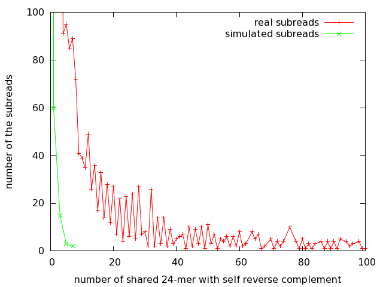
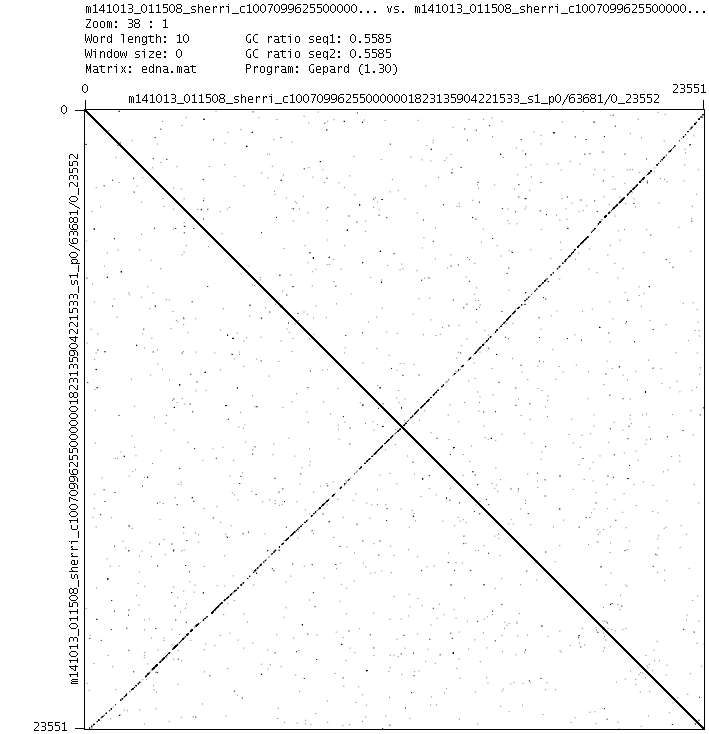
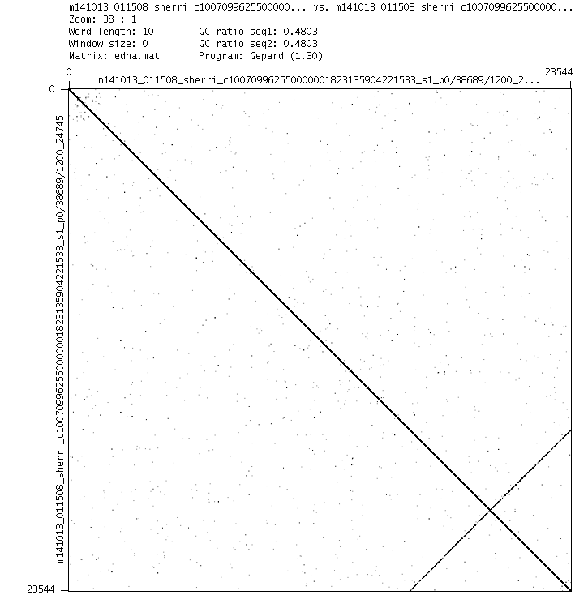
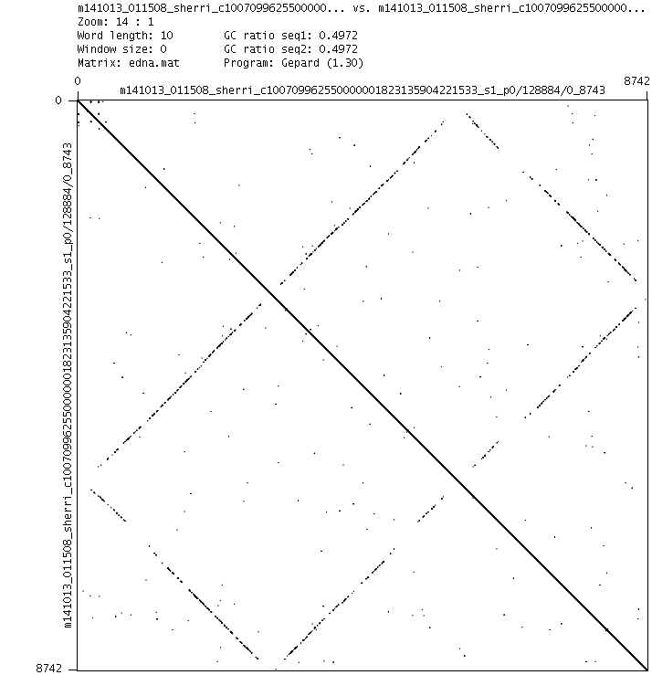

## Introduction

fig.1

We plotted the number of shared 24-mers between the subread and its reverse complementary subread.
The real data have a long tail.
But the simulated data don't.

Why?

## dot plot with itself

We extracted the subreads having many number of shared k-mer (24-mer)
and made dotplots with itself using [gepard](http://cube.univie.ac.at/gepard).

fig.2

fig.3

fig.4

In fig.2 we think that one adapter was ignored and the other was trimmed.

In fig.3 we think that one adapter was ignored and reading was stopped halfway.

In fig.4 we think both adapters were ignored.

We named this type of artifact "x-type artifact".

## Discussion

De novo assembly may be simpler if x-type artifact is removed.

Resequencing will be less affected if high coverage subreads are used.

