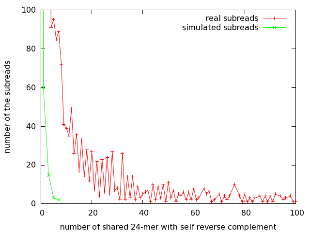
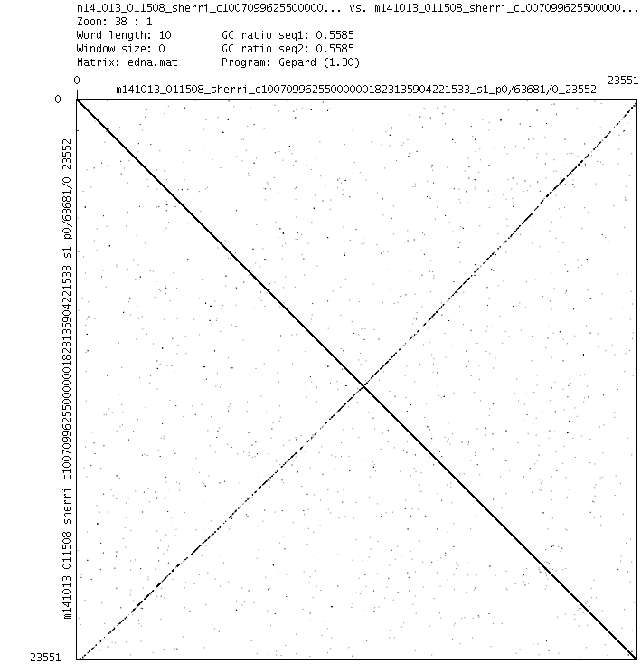
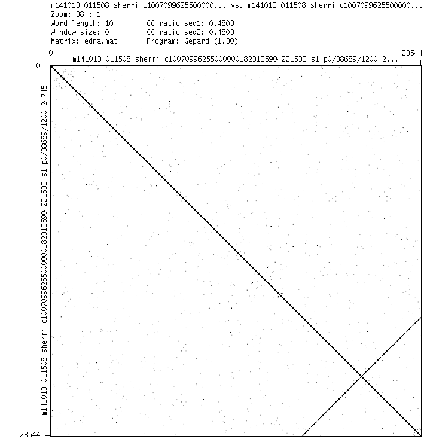
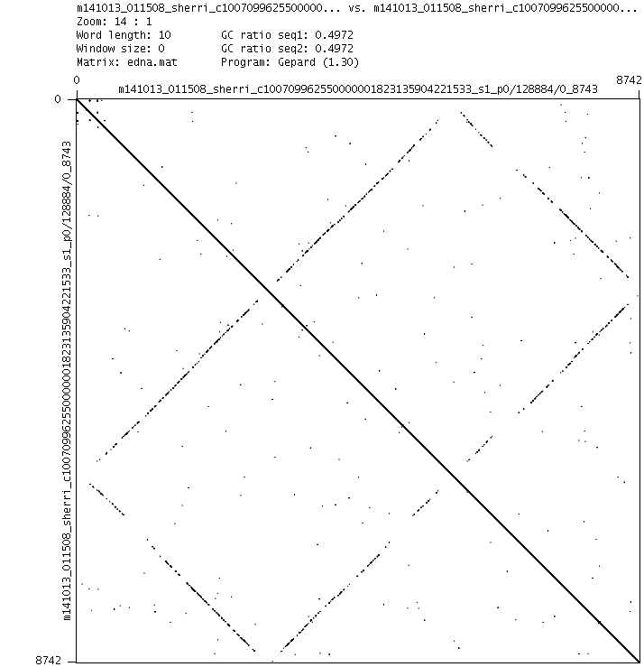

## Introduction



fig.1

We plotted the number of shared 24-mers between the subread and its reverse complement. The data was ~150X of E. coli of p6c4 chemistry.

The real data have a long tail. But the simulated data don't.

Why?

## dot plot with itself

We extracted the subreads having many number of shared k-mer (24-mer) and made dotplots with itself using [gepard](http://cube.univie.ac.at/gepard).



fig.2



fig.3



fig.4

In fig.2 we think that one adapter was ignored and the other was trimmed.

In fig.3 we think that one adapter was ignored and the reading was stopped halfway.

In fig.4 we think both adapters were ignored.

We named this type of artifact "x-type artifact".

We think this is a systematic error of PacBio.

## percentage of x-type artifacts

The percentage of x-type artifacts out of subreads was about 0.3%.

## Discussion

De novo assembly may be simpler if x-type artifact is removed.

Resequencing will be less affected if high coverage subreads are used.

## Methods

###### preparation

```sh
git clone git@bitbucket.org:yun2/pbartifact.git
cd pbartifact/src
make
chmod u+x *.pl
```

Then add a path to pbartifact/src to $PATH .

Install [samtools](https://github.com/samtools/samtools),
[bax2bam](https://github.com/PacificBiosciences/bax2bam),
[pbsim](https://github.com/pfaucon/PBSIM-PacBio-Simulator)
and [gepard](http://cube.univie.ac.at/gepard).

Download E. coli data from [here](https://github.com/PacificBiosciences/DevNet/wiki/E.-coli-Bacterial-Assembly).

```sh
wget https://s3.amazonaws.com/files.pacb.com/datasets/secondary-analysis/e-coli-k12-P6C4/p6c4_ecoli_RSII_DDR2_with_15kb_cut_E01_1.tar.gz
tar xvzf p6c4_ecoli_RSII_DDR2_with_15kb_cut_E01_1.tar.gz
```

Then use src/get_subreads.sh

```sh
cd E01_1/Analysis_Results/
cp ../../src/get_subreads.sh .
bash get_subreads.sh
cat movie*.subreads.fastq > ecoli.p6c4.fastq
cd ../../
ln -s E01_1/Analysis_Results/ecoli.p6c4.fastq .
```

###### pbsim
```sh
wget https://s3.amazonaws.com/files.pacb.com/datasets/secondary-analysis/e-coli-k12-P6C4/polished_assembly.fastq.gz
gzip -d polished_assembly.fastq.gz
fq2fa.pl polished_assembly.fastq > polished_assembly.fa
pbsim.procedure.pl | bash
```

###### gnuplot
open src/csk4gnuplot.v1.pl and edit:
```sh
#my $prefix="ecoli.p6c4";
my $prefix="depth150_0001";
```
then
```sh
src/csk4gnuplot.v1.pl | bash
```

open src/csk4gnuplot.v1.pl and edit:
```sh
my $prefix="ecoli.p6c4";
#my $prefix="depth150_0001";
```
then
```sh
src/csk4gnuplot.v1.pl | bash
```

Then
```sh
gnuplot src/plot.gnuplot
```

###### dotplot real subreads using gepard
```sh
src/csk4gepardinput.v1.pl | bash
# count the number of records:
wc -l ecoli.p6c4.candidates.list

mkdir dot
cd dot
partition_fa.pl ../ecoli.p6c4.candidates.fa <number_of_records_described_above> -p real
wget http://cube.univie.ac.at/sites/cub/files/gepard/gepard-1.30.zip
unzip gepard-1.30.zip
cd gepard-1.30
cp ../../src/gepard_command_generator.pl .
#edit gepard_command_generator.pl and
./gepard_command_generator.pl > tmp.sh
#check tmp.sh and
bash tmp.sh
#you will get dotplots like fig.2-4 (but not all are x-type artifacts).
```

###### percentage

We divided the subreads into 20 chunks.
```sh
partition_fa.pl ecoli.p6c4.fa 20 -p part
```

Files from part_0000.fa to part_0019.fa were generated.

There was no basis in particular, we decided to use part_0002.fa, part_0011.fa and part_0019.fa .

###### 0002

We chose subreads that shared 25 or more kinds of 24mer with its reverse complement
 and made dotplots with itself.

```sh
cat part_0002.fa | grep ">" | wc -l
# 4362 (the number of subreads in part_0002.fa)
csk4gepardinput.min_hit25.pl | bash
cat part_0002.fa.candidates.fa | grep ">" | wc -l
#22
mkdir dot0002
cd dot0002
partition_fa.pl ../part_0002.fa.candidates.fa 22 -p 0002
wget http://cube.univie.ac.at/sites/cub/files/gepard/gepard-1.30.zip
unzip gepard-1.30.zip
cd gepard-1.30
cp pbartifact/src/gepard_command_generator.pl .
# change parameters in gepard_command_generator.pl
# my $prefix="0002"
# my $n_fa=22
./gepard_command_generator.pl | bash
```

After these commands, we got dotplot images (pbartifact/img/img.ecoli.p6c4.tar.gz) .

We regarded 0, 1, 2, 3, 5, 6, 7, 9, 13, 14, 15, 16, 17, 18, 20 and 21 (16 subreads) as x-type artifacts.

16/4362 = 0.366 % was x-type artifact.

We used part_0011.fa and part_0019.fa and got 14/4361=0.321% and 11/4361=0.252% in the same way as part_0002.fa.

We took the average of the three and got 0.31% ~ 0.3%.

###### memo
1. CLRs of Sequel II have the x-type artifact. See [Sequel.md](Sequel.md)

2. the adapter sequence of pacbio is shown at
https://github.com/TomSkelly/PacBioEDA/blob/master/H5BasFile.py

## contact
sprai2017 at gmail dot com

(Takamasa Imai)

