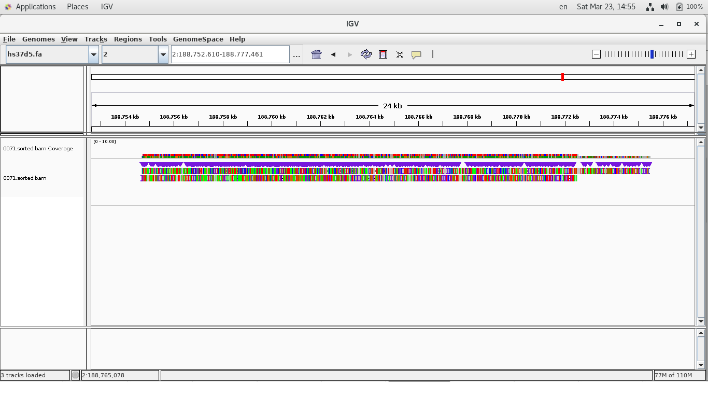
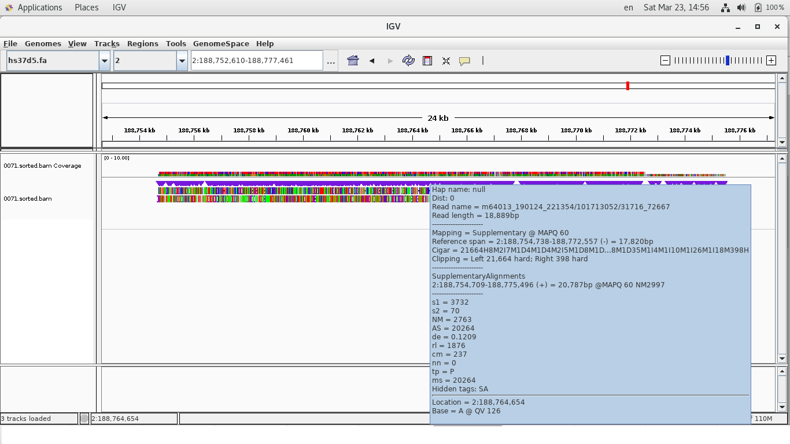

## dot plot with itself

CLRs of Sequel II have the same type of artifact.

See the images below.


fig.1


fig.2


fig.3-5

The CLR of fig.1 was aligned to the genome (hs37d5.fa) by [minimap2](https://github.com/lh3/minimap2)

But it was not aligned end-to-end





fig.6-8

The CLR of fig.2 was aligned to the genome (hs37d5.fa) by minimap2

But it was not aligned end-to-end

## percentage of x-type artifacts

The percentage of x-type artifacts out of CLRs was about 0.4%.

## conclusion
CLRs have at least 0.3% x-type artifacts on average.

## Methods

###data preparation
```sh
wget https://downloads.pacbcloud.com/public/dataset/SV-HG002-CLR/hs37d5.HG002-SequelII-CLR.bam
wget https://downloads.pacbcloud.com/public/dataset/SV-HG002-CLR/hs37d5.HG002-SequelII-CLR.bam.bai
samtools fasta hs37d5.HG002-SequelII-CLR.bam > hs37d5.HG002-SequelII-CLR.fasta
ln -s hs37d5.HG002-SequelII-CLR.fasta sequelIIclr.fa

wget ftp://ftp.1000genomes.ebi.ac.uk/vol1/ftp/technical/reference/phase2_reference_assembly_sequence/hs37d5.fa.gz
```

###dotplot using gepard
```sh
src/csk4gepardinput.pl | bash
head -200 sequelIIclr.fa.candidates.fa > 100.fa

mkdir dot
cd dot
partition_fa.pl ../100.fa 100 -p sequelIIclr
wget http://cube.univie.ac.at/sites/cub/files/gepard/gepard-1.30.zip
unzip gepard-1.30.zip
cd gepard-1.30
cp ../../src/gepard_command_generator.pl .
#edit gepard_command_generator.pl and
./gepard_command_generator.pl > tmp.sh
#check tmp.sh and
bash tmp.sh
#you will get dotplots like fig.1-2 (but not all are x-type artifacts).
```

###alignment

```sh
minimap2 -x map-pb -d hs37d5.mmi hs37d5.fa
minimap2 -ax map-pb hs37d5.mmi <part_of_candidates.fa> > output.sam
```

###percentage

We divided the CLRs into 1000 chunks.
```sh
partition_fa.pl sequelIIclr.fa 1000 -p part
```

Files from part_0000.fa to part_0999.fa were generated.

There was no basis in particular, but we decided to use part_0008.fa, part_0113.fa and part_0765.fa .

###0765

We chose CLRs that shared 25 or more kinds of 24mer with its reverse complement
 and made dotplots with itself.

```sh
cat part_0765.fa | grep ">" | wc -l
# 4256 (the number of CLRs in part_0765.fa)
csk4gepardinput.min_hit25.pl | bash
cat part_0765.fa.candidates.fa | grep ">" | wc -l
#166
mkdir dot0765
cd dot0765
partition_fa.pl ../part_0765.fa.candidates.fa 166 -p 0765
wget http://cube.univie.ac.at/sites/cub/files/gepard/gepard-1.30.zip
unzip gepard-1.30.zip
cd gepard-1.30
cp pbartifact/src/gepard_command_generator.pl .
# change parameters in gepard_command_generator.pl
# my $prefix="0765"
# my $n_fa=166
./gepard_command_generator.pl | bash
```

After these commands, we got dotplot images (pbartifact/img/img0765.tar.gz) .

We regarded 1, 2, 4, 5, 7, 8, 9, 10, 11, 14, 15, 16, 20, 25, 26, 29, 34, 95 and 133 (19 CLRs) as x-type artifacts.

19/4256 = 0.446 % was x-type artifact.

We used part_0008.fa and part_0113.fa and got 19/4257=0.446% and 12/4257=0.281% in the same way as part_0765.fa.

We took the average of the three and got 0.39% ~ 0.4%.

##contact
sprai2017 at gmail dot com

(Takamasa Imai)

